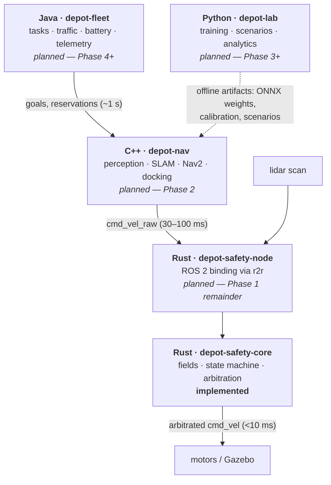

# Depot — Warehouse AMR Fleet

A safety-first autonomous mobile robot stack for warehouse shelf-moving robots, built
and validated in simulation. The velocity-arbitration core that decides what actually
reaches the motors is implemented and proven; the navigation, fleet and simulation
layers around it are planned.


> **Status.** Phase 0 (scaffolding) and the core of Phase 1 (the Rust safety layer) are
> done. The `depot-safety-core` crate below is real, tested and cross-compiled in CI.
> The ROS 2 node binding, the C++ navigation stack, the Java fleet service and the
> Python harness described in [`docs/WORKPLAN.md`](docs/WORKPLAN.md) are **not written
> yet**. Everything in *How to run* refers only to what exists in this repository today.

---

## Why this matters

Warehouse AMRs drive beneath mobile shelf units, lift them, and carry them to picking
stations — sharing corridors with each other and with people walking. The robot's
navigation stack is a large, fast-moving pile of software: planners, costmaps,
localisation filters, fleet schedulers, and increasingly learned perception models. All
of it can be wrong. A planner that emits a bad velocity, a node that dies mid-drive, or
a perception model that misses a person are all ordinary software failures, and in this
setting an ordinary software failure is a person getting hit by a quarter-tonne machine.

The industrial answer is not "make the planner correct". It is to put a small,
independently verifiable layer between every command and the motors, and give that layer
final authority. It is the only part that has to be right. So it should be the part that
is small enough to reason about, deterministic enough to replay, and cheap enough that
its own runtime is irrelevant to the deadline it has to meet.

`depot-safety-core` is that layer. It is a few hundred lines of `no_std` Rust with no
heap, no I/O, no clock access, no unsafe code and no unbounded loops. It consumes a lidar
scan and a requested velocity and returns the velocity that is actually permitted, along
with a machine-readable reason whenever the two differ. Every safety property it claims —
output within vehicle limits, stops engage on the first breached cycle, e-stop latches,
zone limits can only restrict, zero allocations, bit-exact determinism — is asserted by a
test rather than argued in a comment.

---

## Skills demonstrated

**Systems Rust under real-time constraints**
- `#![no_std]` + `#![forbid(unsafe_code)]` library that cross-compiles to
  `thumbv7em-none-eabihf` (a bare-metal Cortex-M target with no allocator at all), enforced
  on every push by CI so `std` cannot creep back in one convenience at a time.
- Zero-allocation design: fixed-capacity arrays (`[f32; MAX_RAYS]`), borrowed scan buffers
  (`Scan<'a>`), saturating counters, no `Vec`/`String`/`Box` anywhere on the hot path.
- Panic-free hot path: `clippy::indexing_slicing`, `unwrap_used`, `expect_used`, `panic`
  and `float_cmp` are lint-denied for the library and deliberately re-allowed for tests.
- `panic = "abort"`, LTO, `codegen-units = 1`, and `overflow-checks = true` retained in
  release — arithmetic safety kept even in the optimised build.

**Safety-critical control design**
- Speed-scaled protective and warning fields derived from actual stopping physics,
  including reaction time and braking capability.
- A latching state machine with asymmetric dynamics — instant to engage, deliberate to
  release — to prevent chatter without ever delaying a stop.
- Strict precedence lattice over veto reasons, so the *most restrictive* rule always wins
  and the reported cause is always the highest-authority one that bound.
- Fail-safe defaults throughout: a robot that has never seen the floor cannot move; a NaN
  range is a sensor fault, not clear floor; a garbled zone limit clamps to zero speed; a
  non-finite speed estimate produces the *largest* field; time moving backwards extends a
  safety hold rather than ending it.

**Verification technique**
- Property-based testing with `proptest`: randomised command/scan/e-stop/jitter sequences,
  with pathological inputs (NaN, ±∞, negative, 1e30) deliberately mixed into the
  generators, checking invariants such as "a closer obstacle never yields a faster
  command" and "the layer is bit-exact deterministic".
- A mechanical allocation proof: a counting `GlobalAlloc` armed around 4,000 cycles driven
  through every branch — protective stops, e-stop latch/reset, watchdog expiry, docking
  mode, sensor reconfiguration — asserting the count stays at exactly zero.
- A latency budget asserted in a test rather than hoped for, with percentiles chosen so
  the assertion measures the algorithm and not the operating system's scheduler.
- Deterministic maths via pure-Rust `libm` instead of compiler intrinsics, so results are
  identical on every target — the precondition for replaying a recorded run bit-for-bit.

**Engineering practice**
- Multi-job GitHub Actions CI: format, clippy-as-errors, tests, doctests, an optimised
  budgets job, and a bare-metal cross-compilation job.
- Cargo workspace with shared lints and package metadata; `rustfmt.toml` tuned to the
  crate's idiom.
- `.gitattributes` normalising line endings to LF because the eventual simulation stack
  runs in Linux containers and a CRLF in a launch script reads as a missing binary.

---

## Architecture

### The authority stack

Control authority *decreases* as you go up. The fleet service requests, the nav stack
plans, and the safety layer decides. Anything above Rust can be wrong without being
dangerous.



Python never enters a control loop. `depot-lab` will produce *artifacts* — ONNX weights,
calibration files, tuned parameters, scenario definitions — and the boundary is enforced
by the artifact format: C++ loads `.onnx`, it does not call Python. CPython's GC and GIL
make *tail* latency unpredictable in a way mean latency hides, and a p99.9 pause of tens
of milliseconds is unremarkable for a training job and a collision in a 10 ms loop.

### Latency budgets

| Component | Budget | Failure mode if missed |
|---|---|---|
| `depot-safety` | 10 ms hard | Collision |
| `depot-nav` local planner | 100 ms soft | Jerky motion, missed obstacles |
| `depot-fleet` allocation | 1 s soft | Idle robots, poor throughput |
| `depot-lab` | offline | None |

The safety budget is the only one currently enforceable, and it is enforced in
`tests/latency.rs`: 20,000 cycles at the worst-case 1,081-ray scan, release build, with
two assertions — **p99 < 1 ms** (a tenth of the budget: the algorithm should be
*irrelevant* to the deadline, not merely inside it) and **p99.9 < 10 ms**. In practice p50
lands in the single-digit microseconds. The observed *maximum* on a desktop OS is
milliseconds of pure scheduler preemption; the test prints it rather than asserting on it,
because eliminating that is a real-time configuration problem for the ROS 2 node, not an
algorithmic one.

### Models

The crate has no ML models. Its models are a **physical model** of stopping distance, a
**geometric model** of the protective field, and a small set of **value types** that form
the safety-layer boundary.

**Physical model — field sizing** (`field.rs`). The protective field is the distance the
robot covers before it can stop:

```text
protective_len = min_protective + v·t_reaction + v² / (2·a_decel) + margin
warning_len    = protective_len × warning_scale
```

The `v²` term is why scaling with speed is not a nicety: a fixed field sized for walking
pace is a collision at full speed, and one sized for full speed makes the robot useless in
a corridor. The field is sized from the *faster* of the current output and the request, so
it has already grown by the cycle the robot accelerates into it.

**Geometric model — polar field test** (`geometry.rs`, `scan.rs`). Fields are forward-facing
rectangles, tested in the sensor's native polar form rather than by converting every ray
to Cartesian. For each bearing there is one question — how far away is the field boundary
in this direction? — costing one division and two comparisons per ray, no square roots, and
no per-ray trigonometry once the direction cosines are cached. Rays with `cos θ ≤ 0` point
sideways or backwards and cannot enter the field, which is what makes it forward-facing.

**Data model — the boundary types**

| Type | Module | Role |
|---|---|---|
| `Twist` | `types` | Planar velocity `{linear, angular}` for a diff-drive base |
| `Command` | `types` | A requested `Twist` plus its *origin* timestamp (drives the watchdog) |
| `Scan<'a>` | `types` | One borrowed lidar revolution: stamp, `angle_min`, increment, range band, ranges |
| `ZoneLimits` | `types` | External speed ceilings (e.g. human proximity) that can only *restrict* |
| `Mode` | `types` | `Normal` or `Docking` field profile |
| `Micros` | `types` | `u64` monotonic timestamp — the crate never reads a clock |
| `SafetyConfig` / `DockingConfig` | `config` | Vehicle limits, timeouts, field parameters; validated once, immutable after |
| `FieldExtent` | `field` | The protective/warning lengths and half-width in force this cycle |
| `ScanGeometry` | `scan` | Cached per-ray `sin`/`cos`, two `[f32; 1081]` arrays (~8.6 KB), rebuilt only on reconfiguration |
| `ScanVerdict` | `scan` | Breach flags, hit counts, closest return; `blind()` is the fail-safe value |
| `ScanError` | `scan` | Why a scan was rejected: empty, oversized, bad `angle_min`/increment |
| `FieldState` | `state` | `Clear` / `Warning` / `ProtectiveStop` |
| `StopCause` | `state` | What latched the current stop — `Obstacle` / `Blind` / `EStop` — held for its whole duration |
| `Tick<'a>` | `arbiter` | One cycle of input: time, optional command, optional scan, e-stop, mode, zone |
| `Decision` | `arbiter` | Output twist, state, veto reason, extent, closest range, latch flag, last `ScanError` |
| `Arbiter` | `arbiter` | The core itself: config + geometry cache + state machine + ramp/watchdog history (~8.7 KB, all inline) |

**Authority model — `VetoReason`** (`arbiter.rs`). A `#[repr(u8)]` ordered enum; a larger
discriminant overrides a smaller one, and the reported reason is always the highest
authority rule that bound this cycle:

```text
None(0) < ZoneLimit(1) < DockingLimit(2) < WarningClamp(3) < StaleVerdictHold(4)
        < CommandInvalid(5) < Watchdog(6) < ProtectiveStop(7) < ScanStale(8) < EStop(9)
```

This is not decoration. When a robot stops mid-aisle, the operator needs to know whether
it *saw* something, lost its *scan*, or lost its *planner* — three causes demanding three
different responses.

### Layout

```
depot/
├── rust/                            Cargo workspace (the only code that exists today)
│   ├── Cargo.toml                   workspace lints, release profile, shared metadata
│   ├── rustfmt.toml
│   └── depot-safety-core/
│       ├── src/
│       │   ├── lib.rs               no_std entry point; guarantees documented + doctested
│       │   ├── types.rs             Twist, Command, Scan, ZoneLimits, Mode, Micros
│       │   ├── config.rs            SafetyConfig, DockingConfig, validation
│       │   ├── geometry.rs          polar forward-rectangle boundary maths
│       │   ├── field.rs             speed-scaled FieldExtent
│       │   ├── scan.rs              ScanGeometry cache + per-ray evaluation → ScanVerdict
│       │   ├── state.rs             latching FieldStateMachine with release hold
│       │   └── arbiter.rs           Tick → Decision: the single point of authority
│       └── tests/
│           ├── harness/mod.rs       synthetic sensor: empty floor, wall, shelf legs
│           ├── arbitration.rs       behavioural scenarios (15)
│           ├── properties.rs        proptest invariants (9)
│           ├── latency.rs           the 10 ms budget, asserted (1)
│           └── no_alloc.rs          counting allocator, zero heap traffic (1)
├── docs/WORKPLAN.md                 13 phases, each with an explicit done-when
└── .github/workflows/rust.yml       test · budgets · no_std jobs
```

`cpp/`, `java/`, `python/`, `sim/` and `infra/` appear in the workplan and in
`.gitignore`, but do not exist yet.

---

## How it works

One control cycle, end to end. The caller — eventually the ROS 2 node — builds a `Tick`
and calls `Arbiter::step`, which runs a single bounded pass over the scan and a fixed
amount of arithmetic, then returns a `Decision`.

1. **Timestep.** Elapsed time since the last cycle, clamped to 50 ms. A stalled loop must
   not earn the right to a large velocity step.
2. **E-stop.** An asserted line latches; only an explicit `estop_reset` acknowledgement
   clears it. The latch drives the same field state machine as a breach, so the reported
   state can never contradict the output, and re-arming after an acknowledgement waits
   out the ordinary `clear_hold_us` release hold rather than resuming instantly.
3. **Intake.** A non-finite command is discarded (`CommandInvalid`) and the held command
   zeroed — a NaN reaching the motors is a runaway. The watchdog tracks the age of the
   freshest *valid* command, so a stream of NaNs looks like silence, not health.
4. **Field sizing.** `FieldExtent::compute` sizes the protective and warning fields from
   the faster of the current output and the request, under the current `Mode`.
5. **Perception.** If a scan arrived, `ScanGeometry::ensure` rebuilds the direction-cosine
   cache only if the sensor geometry changed, then `evaluate` tests every ray against both
   fields in one pass. Non-finite ranges and returns outside `[range_min, range_max]` are
   no-returns, excluded explicitly — a NaN compared with `<` is quietly false and would
   otherwise read as "nothing there". Between scans the previous verdict stands, but only
   at the speed it was evaluated for: a verdict computed against a field sized for 0.3 m/s
   says nothing about the field at 0.6 m/s, so speed is pinned (`StaleVerdictHold`) until a
   fresh scan arrives. Past `scan_timeout_us` the robot is *blind*, and blindness is a
   protective breach, because absence of evidence is not evidence of a clear floor.
6. **State machine.** A breach latches `ProtectiveStop` on the first cycle it is seen, with
   no filtering or confirmation. Release requires the field to have been continuously clear
   for `clear_hold_us`; one bad cycle restarts the timer. The latch records its `StopCause`,
   which is what gets reported for the whole hold — a stop caused by one blind cycle keeps
   reading `ScanStale` even after clear scans resume, rather than being blamed on an
   obstacle nobody ever saw.
7. **Limits, weakest authority first.** Vehicle ceilings → zone limits → docking ceiling →
   warning-field clamp. Each records its `VetoReason` only if it actually changed the
   command. Zone limits are intersected with the configured maxima, so a misbehaving
   perception node can never *raise* the robot's speed.
8. **Stops, strongest authority last.** A watchdog expiry ramps down — the planner has gone
   quiet but the floor is still clear, and slamming to zero at speed is its own hazard. A
   protective breach or a latched e-stop commands zero on this cycle with no ramp at all.
9. **Ramp and belt-and-braces.** Non-stop outputs are rate-limited, accelerating gently
   (`max_accel`) and braking hard (`max_decel`). The result is then re-clamped to the
   vehicle limits and zeroed if non-finite — the one line that must hold regardless of any
   mistake in the lines above it.

**Docking** is the interesting special case: the robot is deliberately driving *at* a known
obstacle, so the normal field would latch a stop on the shelf itself. The response is a
narrower, shorter field plus hard ceilings on *both* forward speed and yaw rate — validated
at construction to be no wider, no faster and no quicker-turning than the normal profile —
never a disabled field. The yaw ceiling matters as much as the linear one: the field faces
forward, so spinning under a shelf sweeps the corners of the base through floor the field
never covered. The robot still stops for anything closer than the docking field.

---

## How to run

### Prerequisites

- A Rust toolchain (stable). The workspace declares `rust-version = "1.75"`, which CI
  verifies against the *library* on a pinned 1.75 toolchain. The test suite needs a
  current stable: `proptest`'s own dependency graph is far newer than the MSRV the
  library offers its consumers.
- Nothing else. `depot-safety-core` has one dependency (`libm`) plus `proptest` for tests,
  no ROS, no system libraries. It builds on any host.
- For the bare-metal check only: `rustup target add thumbv7em-none-eabihf`.

There is no installation step, no configuration file and no environment variable. Tuning
lives in `SafetyConfig`, validated at `Arbiter::new` and immutable afterwards — there is
deliberately no runtime tuning path, because a field that *can* be shrunk while the robot
is moving eventually *will* be.

### Test and verify

All commands run from `rust/`.

```bash
# Everything, optimised: 53 tests (27 unit, 15 behavioural, 9 property,
# 1 latency, 1 allocation guard). The latency test is `#[ignore]`d — it is only
# meaningful optimised, so it is run explicitly rather than swept up by a debug run.
cargo test --release --all-targets

# The 10 ms budget, with the measured percentile table printed.
cargo test --release --test latency -- --ignored --nocapture

# The zero-allocation guarantee: 4000 cycles through every branch, count must be 0.
cargo test --release --test no_alloc

# The documented guarantees in lib.rs are executable.
cargo test --doc

# Lints. The library is held to no-panic / no-indexing / no-float-equality discipline.
cargo fmt --all --check
cargo clippy --all-targets -- -D warnings

# Still bare-metal: no allocator, no std, no OS.
cargo build -p depot-safety-core --target thumbv7em-none-eabihf --release
```

> Run the latency test in `--release`. A debug build is roughly forty times slower and will
> fail the p99 assertion — which is the assertion doing its job, not a flaky test. That is
> why it carries `#[ignore]`: an unoptimised `--all-targets` run must not pick it up.

### Use it as a library

```rust
use depot_safety_core::{Arbiter, FieldState, SafetyConfig, Tick, Twist};

let mut arbiter = Arbiter::new(SafetyConfig::default()).unwrap();
// No scan has ever arrived, so the layer refuses to move.
let decision = arbiter.step(&Tick::new(0));
assert_eq!(decision.twist, Twist::ZERO);
assert_eq!(decision.state, FieldState::ProtectiveStop);
```

Per cycle, the caller builds a `Tick` with `.with_scan(...)`, `.with_cmd(...)`,
`.with_mode(...)`, `.with_zone(...)`, sets `estop` / `estop_reset`, calls `step`, and
publishes `decision.twist`. Timestamps are supplied by the caller in microseconds; the core
never reads a clock, which is what makes a recorded run replayable bit-for-bit.

### CI

[`.github/workflows/rust.yml`](.github/workflows/rust.yml) runs on any push touching
`rust/**`, in four jobs: **test** (fmt, clippy with `-D warnings`, tests, doctests),
**budgets** (latency and allocation guard, release only — both are meaningless against an
unoptimised build), **msrv** (the declared 1.75 checked on a pinned 1.75 toolchain), and
**no_std** (the `thumbv7em-none-eabihf` cross-compile).

---

## Roadmap

[`docs/WORKPLAN.md`](docs/WORKPLAN.md) lays out thirteen phases, each with an explicit
done-when, because "working on the nav stack" is how projects die.

- [x] **Phase 0** — environment scaffolding *(partially met: layout and Rust toolchain exist; the Gazebo world and launch file do not)*
- [ ] **Phase 1** — Rust safety layer *(core done and proven; the `depot-safety-node` ROS 2 binding via `r2r` is outstanding)*
- [ ] **Phase 2** — C++ navigation, single robot
- [ ] **Phase 3** — Python simulation harness
- [ ] **Phase 4** — Java fleet service, single robot
- [ ] **Phases 5–12** — docking, multi-robot, traffic management, task allocation, battery, perception training, analytics, write-up

The two genuinely distinctive pieces are the safety arbitration boundary and the deadlock
resolution work in Phase 7; both survive the cut-down plan.

---

## Licence

Apache-2.0, as declared in the workspace manifest.
